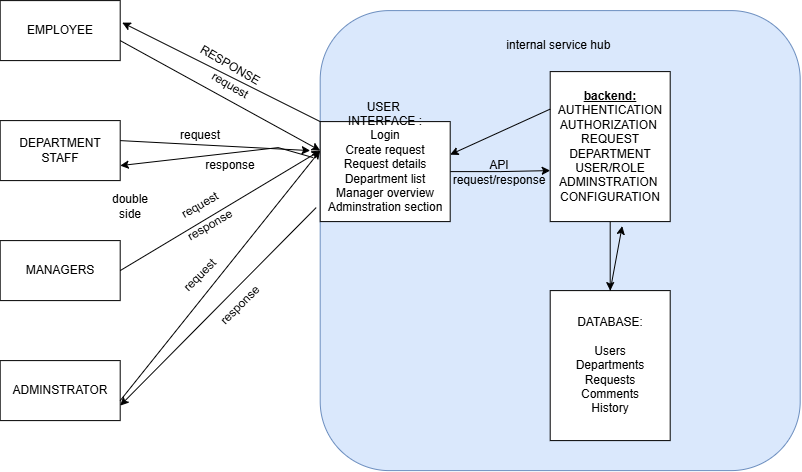

# Internal Operations Service Hub

## Overview

The Internal Operations Service Hub is an internal company platform that allows employees to submit service requests to departments such as IT, HR, and Finance.

The system provides one centralized place where employees can create requests and track their progress, while department staff can manage and update the requests assigned to their department.

The system supports four main user roles:

- Employee
- Department Staff
- Manager
- Administrator

# Main Features

- User authentication and authorization
- Create service requests
- Select the appropriate department
- View and track requests
- Update request status
- Add comments or notes
- Department-based request management
- Manager request overview
- User, role, and department administration
- Request history
- Role-based access control

## Project Documentation

The project documentation is located in the `docs` folder:

- Product Specification:(docs/product-spec.md)
- Architecture:(docs/architecture-spec.md)
- Data Model:(docs/data-model.md)
- ADR-001: Department-Scoped Role-Based Access Control:(docs/decisions/ADR-001.md)

## Architecture

The Internal Operations Service Hub uses a centralized architecture consisting of:

- User Interface
- Authentication and Authorization
- Request Management
- Department Management
- User and Role Management
- Persistent Database

## FirstVersion

The first version focuses on the product foundation and basic request-management requirements.

It does not yet include:

- Attachments
- Email or system notifications
- External customers
- Advanced analytics
- Complete frontend/backend implementation
- Reopening closed requests

## Project Documentation

- [Product Specification](docs/product-spec.md)
- [Architecture](docs/architecture.md)
- [Data Model](docs/data-model.md)
- [ADR-001: Department-Scoped Role-Based Access Control](docs/decisions/ADR-001.md)